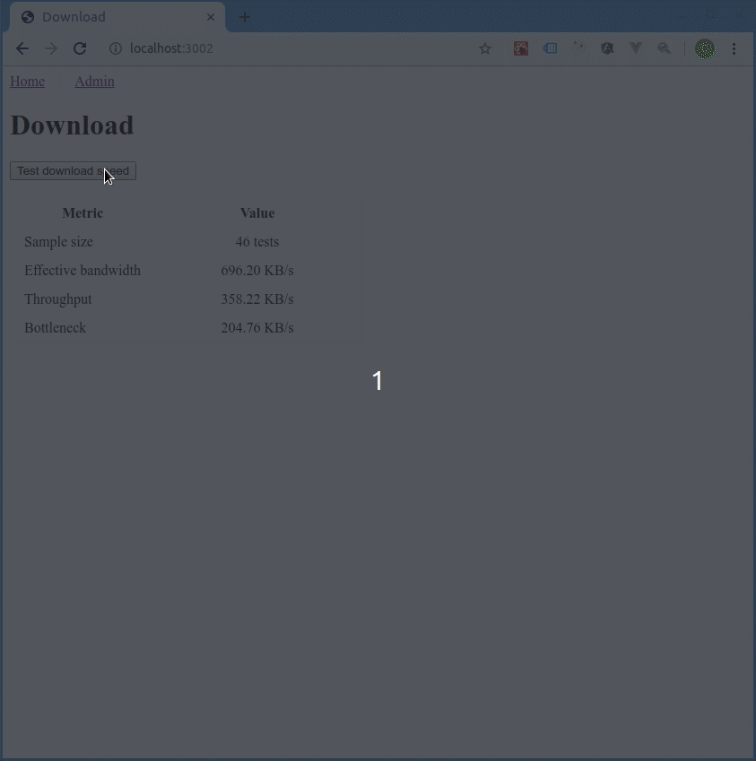

# Web App
The web app is to provide an api service to request for download bandwidth information. The main question of concern is what is the formula for download speed.

## Product Backlog
- diagnostic tool
- response UI
- user feedback 

## Design
Json is used for loosely coupled communication with other apps. An api layer between other services should be used to sanitize and validate information before sending to user. 

## Problems
Server speed seems too low, probably need to look through the api again and do 
more research on tcp to see how the handshakes and time to first byte works. 

## Usage
```
cd web_app
npm install
npm start
```

## GUI


## Credits
- Image is from [effigis](https://effigis.com/en/solutions/satellite-images/satellite-image-samples/)
- Good design & implementation patterns are based on advice from interviewers