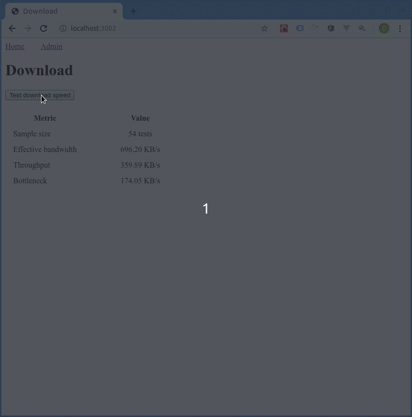

# Web App
The web app is to provide an api service to request for download bandwidth information. The main question of concern is what is the formula for download speed.

## Product Backlog
- diagnostic tool
- response UI
- user feedback 

## Design
Json is used for loosely coupled communication with other apps. An api layer between other services should be used to sanitize and validate information before sending to user. 

## Problems
- Server speed seems too low, probably need to look through the api again and do more research on tcp to see how the handshakes and time to first byte works. TCP socket connection is already at the level of unique end-to-end connections, so maybe the problem is on client side?
- (client-side download speed) Interviewer's technical specification on download speed for users is to capture download time ended when client ends data transmission not when data is ready for consumption (ie. when movie is ready and starts) so the implementation now is wrong. In order to capture data transmission has ended and a FIN packet is sent, we have to use raw sockets for different browsers. The user specification is to know how download speed affects what they are doing with the front-end, so we should account for latency from execution and data manipulation time. So we should use a latency factor and set categories to show users how severe the download speed on usability is. For instance, unsupported download speed to watch movie. Something users can understand. In order to set the categories, we have to do UX research to understand when users feel application is unusable by the user and capture the quantitative data to set a threshold for the categories. Or we can just log user behavior to the server from the client side.

## Usage
```
cd web_app
npm install
npm start
```

## GUI


## Credits
- Image is from [effigis](https://effigis.com/en/solutions/satellite-images/satellite-image-samples/)
- Good design & implementation patterns are based on advice from interviewers